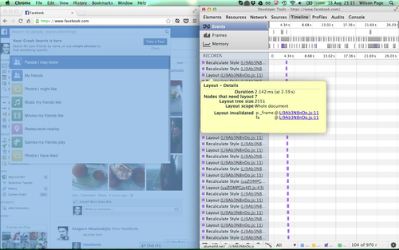
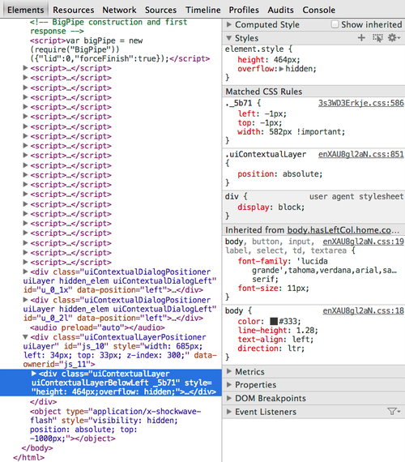
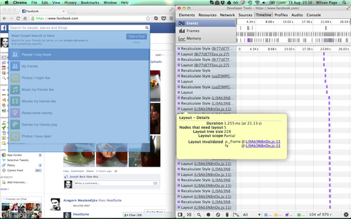

# 布局边界 Layout Boundaries

翻译原文：[Introducing 'layout boundaries'](http://wilsonpage.co.uk/introducing-layout-boundaries/)

   `Layout` 是浏览器渲染管道处理过程之一，主要计算 DOM 元素的位置、大小等信息提供给之后的绘制流程。这一过程开销很大，特别是在低端移动设备上。

   作为一个考虑周到的前端开发，保证 Layouts 开销最小化，确保 Apps 运行流畅是我们的责任之一。在某些情况下，layout 的开销无法避免。通过 JS 改变 DOM 结构，修改元素尺寸和读取 DOM 元素位置、大小等属性，都会触发 layout。

   但不为人所知的是，layout 有影响范围。大多数时间，局部的 DOM 变动，layout 会引发整个文档重排，这意味着成百上千的节点会受影响。

### 介绍布局边界
   我能够利用少量的 CSS 修改，强迫提升布局边界。这意味着，在布局边界范围内触发的 Layout，只会造成局部重排，节省了开销。

### 提升布局边界条件

- `<svg>` 、text 文本、`<input>`

or:

- `display` 不能为 `inline` 或 `inline-block` 
- `width`、`height` 不能为百分比
- `height` 不能隐式 或 `auto`
- `width` 不能隐式 或 `auto`
- `overflow` 明确为 `scroll` 或 `auto` 或 `hidden`
- 不能是 `table` 的后代元素

[Paul Lewis](http://twitter.com/aerotwist)' [Boundarizr](https://github.com/paullewis/Boundarizr/) 的工具能高亮显示拥有布局边界的元素。

### 实践

为了证明我的观点，我发现脸书上一个可以优化的例子。当模糊搜索下拉框展开时，在 Chrome 的开发工具中，仅仅在局部的下拉列表中发生DOM插入删除操作，可以看到大范围的布局刷新。

通过在Chrome Devtools Timeline(已废弃，改为Performance) 中，悬停布局事件，能看到布局范围 `Layout scope` 被标记为整个文档 `Whole document` (蓝色高亮)，影响文档节点 `Layout tree size` 的个数为 `2551 nodes`，耗时 `Duration` : `2.142ms` 。

定位到下拉搜索框面板频繁变动的合理父级元素，设置具体像素 `height` 和 `overflow: hidden` 。该元素已经有 `position: absolute` 和具体像素 `width`，就不用重复设置了。

以上操作会强制提升布局边界，之后的重排只会限制在布局边界文档内。

现在再次输入关键字进行查询，并观察布局事件信息。

当再次悬停查看布局事件，能看到蓝色高亮遮罩层只覆盖了进行提升布局边界的元素。优化后，布局范围 `Layout scope` 被标记为部分文档 `partial` ，影响文档节点 `Layout tree size` 的个数为 `228 nodes`(`减少了91%`)，耗时 `Duration` : `1.255ms`(`节约了 41%`) 。

### 微优化 micro-optimisation ？

在每个布局周期大概节约 `1ms` 似乎微不足道，但是让我考虑一下几点：

1. 该事件只是在搜索框改变关键字露出选项时触发的 20 多个事件中的一个，通过微量的 CSS 修改，每一个事件都能获得相似的性能提升。
2. 我们是在高性能的 MacBook 上的 Google Chrome 中进行分析的，在当前的测试环境性能远高于大多数高性能移动设备。如果能在当前环境下提升 40% 的性能，那么在低性能的设备中将获得巨大的性能提升。
3. 这个布局例子相当简单，在更复杂的页面布局中(flexbox, tables, floats, etc)，可能会收获更大的性能提升。

### 布局边界工作原理 ？

不明

### 以上结论只适用于 Chrome ？

不明

### 结论

对于我来说，这种优化在开发过程中考虑的有点深了。如果我们明细知道局部会频繁修改，却影响范围有限，少量的 CSS 改变强制提升布局边界，能节省浏览器不必要的大范围布局开销，节省布局时间，提升性能。