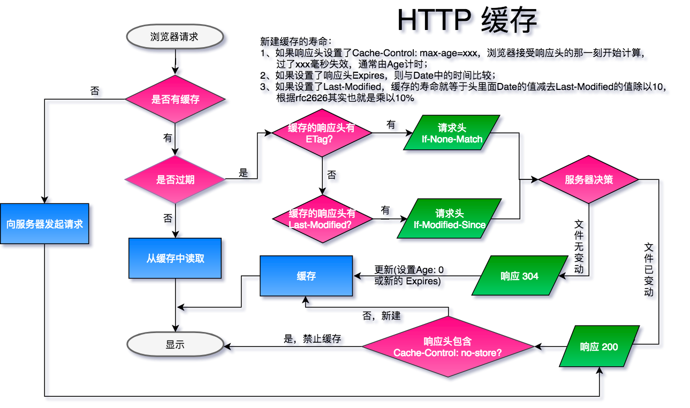

[toc]
# HTTP Cache

-------------------

## 什么是 HTTP Cache

 - 我们知道通过网络获取资源缓慢且耗时，需要三次握手等协议与远程服务器建立通信，对于大点的数据需要多次往返通信大大增加了时间开销，并且当今流量依旧没有理想的快速与便宜。对于开发者来说，长久缓存复用重复不变的资源是性能优化的重要组成部分。
 - HTTP 缓存机制就是，配置服务器响应头来告诉浏览器是否应该缓存资源、是否强制校验缓存、缓存多长时间；浏览器非首次请求根据响应头是否应该取缓存、缓存过期发送请求头验证缓存是否可用还是重新获取资源的过程。下面我们就来结合简单的 node 服务器代码(文末)来介绍其中原理。
 
## 关键字
| 响应头      |   (常用)值 | 说明  |
| :-------- | :--------| :-- |
| [Cache-Control](https://developer.mozilla.org/zh-CN/docs/Web/HTTP/Headers/Cache-Control)  | no-cache, no-store, must-revalidate, max-age, public, private |控制浏览器是否可以缓存资源、强制缓存校验、缓存时间   |
| [ETag](https://developer.mozilla.org/zh-CN/docs/Web/HTTP/Headers/ETag)     |   文件指纹（hash码、时间戳等可以标识文件是否更新） |  强校验，根据文件内容生成精确  |
| [Last-Modified](https://developer.mozilla.org/zh-CN/docs/Web/HTTP/Headers/Last-Modified) |  请求的资源最近更新时间   | 弱校验， 根据文件修改时间，可能内容未变，不精确 |
| [Expires](https://developer.mozilla.org/zh-CN/docs/Web/HTTP/Headers/Expires) |  资源缓存过期时间   | 与响应头中的 Date 对比  |

| 请求头      |   值 | 说明  |
| :-------- | :--------| :-- |
| [If-None-Match](https://developer.mozilla.org/zh-CN/docs/Web/HTTP/Headers/If-None-Match)  | 缓存响应头中的 ETag 值 |发送给服务器比对文件是否更新（精确）   |
| [If-Modified-Since](https://developer.mozilla.org/zh-CN/docs/Web/HTTP/Headers/If-Modified-Since) |  缓存响应头中的 Last-Modified 值 |  发送给服务器比对文件是否更新（不精确）  |

## 简单流程图


## 代码准备
 - index.html
 - img.png
 - server.js
 
	为了不影响阅读代码贴在页尾，注意需要自行安装 `mime` npm包。

## 不设置
 - 不设置响应头，则浏览器并不能知道是否应该缓存资源，而是每次都发送新的请求，接受新的资源。
 

```javascript
// strategy['no-cache'](req, res, filePath, stat);
// strategy['no-store'](req, res, filePath, stat);
// strategy['cache'](req, res, filePath, stat);
strategy['nothing'](req, res, filePath, stat);
```

```bash
node server.js
```

> 浏览器里输入：localhost:8080/index.html

 - 首次加载


 - 刷新，每次和上面一样的效果，都是重新获取资源。
 

## 明确禁止缓存
 - 设置响应头

```
Cache-Control: no-store
或 
Cache-Control: no-cache, no-store, must-revalidate
```

```javascript
strategy['no-store'](req, res, filePath, stat);
```


 效果和不设置一样，只是明确告诉浏览器禁止缓存资源。

## private与public


 - `Cache-Control: public` 表示一些中间代理、CDN等可以缓存资源，即便是带有一些敏感 HTTP 验证身份信息甚至响应状态代码通常无法缓存的也可以缓存。通常 public 是非必须的，因为响应头 max-age 信息已经明确告知可以缓存了。
 - `Cache-Control: private` 明确告知此资源只能单个用户可以缓存，其他中间代理不能缓存。原始发起的浏览器可以缓存，中间代理不能缓存。例如：百度搜索时，特定搜索信息只能被发起请求的浏览器缓存。


## 缓存过期策略
一般缓存机制只作用于 `get` 请求
### 1、三种方式设置服务器告知浏览器缓存过期时间
设置响应头（注意浏览器有自己的缓存替换策略，即便资源过期，不一定被浏览器删除。同样资源未过期，可能由于缓存空间不足而被其他网页新的缓存资源所替换而被删除。）：
 
 1. 设置 `Cache-Control: max-age=1000` 响应头中的 `Date` 经过 `1000s` 过期 
 1. 设置 `Expires` 此时间与本地时间(响应头中的 Date )对比，小于本地时间表示过期，由于本地时钟与服务器时钟无法保持一致，导致比较不精确
 1. 如果以上均未设置，却设置了 `Last-Modified` ，浏览器隐式的设置资源过期时间为 `(Date - Last-Modified) * 10%` 缓存过期时间。


### 2、两种方式校验资源过期
设置请求头：

 1. `If-None-Match` 如果缓存资源过期，浏览器发起请求会自动把原来缓存响应头里的 `ETag` 值设置为请求头 `If-None-Match` 的值发送给服务器用于比较。一般设置为文件的 hash 码或其他标识能够精确判断文件是否被更新，为强校验。
 1. `If-Modified-Since` 同样对应缓存响应头里的 `Last-Modified` 的值。此值可能取得 [ctime](http://nodejs.cn/api/fs.html#fs_stats_ctime) 的值，该值可能被修改但文件内容未变，导致对比不准确，为弱校验。

下面以常用设置了 `Cache-Control: max-age=100` 和 `If-None-Match` 的图示说明：


 - 1、(以下便于测试，未准确设置为 100s 。)浏览器首次发起请求，缓存为空，服务器响应：


 
 浏览器缓存此响应，缓存寿命为接收到此响应开始计时 100s 。
 
 - 2、10s 过后，浏览器再次发起请求，检测缓存未过期，浏览器计算 Age: 10 ，然后直接使用缓存，这里是直接去内存中的缓存，from disk 是取磁盘上的缓存。（`这里不清楚为什么，同样的配置，index.html 文件即便有缓存也 304。`）

 

 - 3、100s 过后，浏览器再次发起请求，检测缓存过期，向服务器发起验证缓存请求。如果服务器对比文件已发生改变，则如 1；否则不返回文件数据报文，直接返回 304。`返回 304 时设置 Age: 0 与不设置效果一样， 猜测是浏览器会自动维护。`

 

## 强制校验缓存
有时我们既想享受缓存带来的性能优势，可有时又不确认资源内容的更新频度或是其他资源的入口，我们想此服务器资源一旦更新能立马更新浏览器的缓存，这时我们可以设置
> Cache-Control: no-cache


再次发起请求，无论缓存资源有没有过期都发起验证请求，未更新返回 304，否则返回新资源。

## 性能优化
现在一些单页面技术，构建工具十分流行。一般一个 html 文件，每次打包构建工具都会动态默认把众多脚本样式文件打包成一个 bundle.hashxxx.js 。虽然一个 js 文件看似减少了 HTTP 请求数量，但对于有些三方库资源等长期不变的资源可以拆分出来，并设置长期缓存，充分利用缓存性能优势。这时我们完全可以对经常变动的 html 设置 `Cache-Control: no-cahce` 实时验证是否更新。而对于链接在 html 文件的资源名称均带上唯一的文件指纹（时间戳、版本号、文件hash等），设置 max-age 足够大。资源一旦变动即标识码也会变动，作为入口的 html 文件外链改变，html 变动验证返回全新的资源，拉取最新的外链资源，达到及时更新的效果。老的资源会被浏览器缓存替换机制清除。流程如下：


## 期中总结：HTTP 缓存性能检查清单
 -  确保网址唯一：一般浏览器以 `Request URL` 为键值(区分大小写)缓存资源，不同的网址提供相同的内容会导致多次获取缓存相同的资源。`ps：常见的更新缓存的方式：在网址后面来加个 v=1,例如 https://xxx.com?v=1 来更新新的资源，但是这样的更新方式有极大的弊端。`
 - 确保服务器提供了验证令牌 `ETag` ：提供资源对比机制。`ps：服务器每次验证文件的话，太耗性能，现代前端构建工具都能自动更新文件hash，不需要设置Tag了，直接设置长缓存时间。`
 - 确定中间代理可以缓存哪些资源：对于个人隐私信息可以设置 `private`，对于公共资源例如 CDN 资源可以设置 `public`。
 - 为每个资源设置最佳的缓存寿命：`max-age 或 Expires`，对于不经常变动或不变的资源设置尽可能大的缓存时间，充分利用缓存性能。
 - 确认网站的层次机构：例如单页面技术，对于频繁更新的主入口 index.html 文件设置较短的缓存周期或 `no-cache` 强制缓存验证，以确保外链资源的及时更新。
 - 最大限度减少文件搅动：对于要打包合并的文件，应该尽量区分频繁、不频繁变动的文件，避免频繁变动的内容导致大文件的文件指纹变动（后台服务器计算文件 hash 很耗性能），尽量频繁变动的文件小而美，不经常变动例如第三方库资源可以合并减少HTTP请求数量。

 ## 前端工程化

 

- 曾经，前端的概念只是编写一些页面、样式、简单脚本，然后丢给服务器就可以了，真是简单有趣...

 

- 进步青年想，对于不变的资源能不能利用缓存呢，于是有：

 

- 304有时也觉得浪费，这个请求我也想省了，未过期就不发请求：

 

- 完美！那么问题来了，有新资源我如何实时发布更新呢？
- 方案一：查询字符加版本号

 

- 更新资源只要更新版本号

 

- 问题来了：我可能每次只有一两个文件修改了，我得更新多有文件版本号？！

 

- 弊端：更新若干资源必须全部文件版本升级，未变动资源缓存也不能利用了。
- 方案二：查询字符加文件哈希

 

- 大点的公司服务器肯定不止一个，静态资源需要做集群部署、CDN等。

 

- 问题来了：我是先发动态页面，还是先发静态资源？

 

- 答案是：都不行！

弊端：
1. 先发页面，这时用户正好打开了新页面，此时新资源未更新，拉取老的静态资源，并缓存，导致错误。
1. 先发资源，这时新用户正好打开老的页面，拉取新资源，导致出错。
（熟悉的声音：是你缓存有问题吧，清下缓存...）。
这就是为什么要等到三更半夜，等用户休息了，先发静态资源，再发动态页面。

- 方案三：根据文件内容生成文件名，这就完美解决了文件更新的问题：

 

- 非覆盖式更新，改变某文件，生成新的文件并更新页面引用链接一并上传服务新文件，不影响以前用户，又能实时更新文件，完美！

- 问题来了，那我怎么写代码，图片、CSS、JS等静态资源怎么去维护，修改了生成新的文件，更新新的外链。。。这就不是人力所能为了。

前端工程化议题应运而生，欢迎补玉。


## 参考
1. [mozilla：HTTP 缓存](https://developer.mozilla.org/zh-CN/docs/Web/HTTP/Caching_FAQ)
1. [大公司里怎样开发和部署前端代码](https://github.com/fouber/blog/issues/6)
1. [谷歌有关性能的文字：HTTP 缓存](https://developers.google.com/web/fundamentals/performance/optimizing-content-efficiency/http-caching)
1. [node中的缓存机制](https://juejin.im/post/5aa39a12f265da237c68834c)
1. [w3c Header定义](https://www.w3.org/Protocols/rfc2616/rfc2616-sec14.html) 
1. [彻底弄懂 Http 缓存机制 - 基于缓存策略三要素分解法](https://mp.weixin.qq.com/s?__biz=MzA3NTYzODYzMg==&mid=2653578381&idx=1&sn=3f676e2b2e08bcff831c69d31cf51c51)
1. [听说你用webpack处理文件名的hash？那么建议你看看你生成的hash对不对](https://www.imooc.com/article/details/id/21538)

## 附代码
index.html

```html
<!DOCTYPE html>
<html lang="en">
<head>
    <meta charset="UTF-8">
    <title>HTTP Cache</title>
</head>
<body>
    
    <!-- <script src="https://cdn.bootcss.com/jquery/3.3.1/jquery.min.js"></script> -->
</body>
</html>
```
server.js

```javascript
let http = require('http');
let url = require('url');
let path = require('path');
let fs = require('fs');
let mime = require('mime');// 非 node 内核包，需 npm install
let crypto = require('crypto');

// 缓存策略
const strategy = {
  'nothing': (req, res, filePath) => {
    fs.createReadStream(filePath).pipe(res);
  },
  'no-store': (req, res, filePath, stat) => {
    // 禁止缓存
    res.setHeader('Cache-Control', 'no-store');
    // res.setHeader('Cache-Control', ['no-cache', 'no-store', 'must-revalidate']);
    // res.setHeader('Expires', new Date(Date.now() + 30 * 1000).toUTCString());
    // res.setHeader('Last-Modified', stat.ctime.toGMTString());

    fs.createReadStream(filePath).pipe(res);
  },
  'no-cache': (req, res, filePath, stat) => {
    // 强制确认缓存
    // res.setHeader('Cache-Control', 'no-cache');
    strategy['cache'](req, res, filePath, stat, true);
    // fs.createReadStream(filePath).pipe(res);
  },
  'cache': async (req, res, filePath, stat, revalidate) => {
    let ifNoneMatch = req.headers['if-none-match'];
    let ifModifiedSince = req.headers['if-modified-since'];
    let LastModified = stat.ctime.toGMTString();
    let maxAge = 30;

    let etag = await new Promise((resolve, reject) => {
      // 生成文件 hash
      let out = fs.createReadStream(filePath);
      let md5 = crypto.createHash('md5');
      out.on('data', function (data) {
        md5.update(data)
      });
      out.on('end', function () {
        resolve(md5.digest('hex'));
      });
    });
    console.log(etag);
    if (ifNoneMatch) {
      if (ifNoneMatch == etag) {
        console.log('304');
        // res.setHeader('Cache-Control', 'max-age=' + maxAge);
        // res.setHeader('Age', 0);
        res.writeHead('304');
        res.end();
      } else {
        // 设置缓存寿命
        res.setHeader('Cache-Control', 'max-age=' + maxAge);
        res.setHeader('Etag', etag);
        fs.createReadStream(filePath).pipe(res);
      }
    }
    /*else if ( ifModifiedSince ) {
        if (ifModifiedSince == LastModified) {
            res.writeHead('304');
            res.end();
        } else {
            res.setHeader('Last-Modified', stat.ctime.toGMTString());
            fs.createReadStream(filePath).pipe(res);
        }
    }*/
    else {
      // 设置缓存寿命
      // console.log('首次响应！');
      res.setHeader('Cache-Control', 'max-age=' + maxAge);
      res.setHeader('Etag', etag);
      // res.setHeader('Last-Modified', stat.ctime.toGMTString());

      revalidate && res.setHeader('Cache-Control', [
        'max-age=' + maxAge,
        'no-cache'
      ]);
      fs.createReadStream(filePath).pipe(res);
    }
  }

};

http.createServer((req, res) => {
  console.log(new Date().toLocaleTimeString() + '：收到请求')
  let {pathname} = url.parse(req.url, true);
  let filePath = path.join(__dirname, pathname);
  // console.log(filePath);
  fs.stat(filePath, (err, stat) => {
    if (err) {
      res.setHeader('Content-Type', 'text/html');
      res.setHeader('404', 'Not Found');
      res.end('404 Not Found');
    } else {
      res.setHeader('Content-Type', mime.getType(filePath));

      // strategy['no-cache'](req, res, filePath, stat);
      // strategy['no-store'](req, res, filePath, stat);
      strategy['cache'](req, res, filePath, stat);
      // strategy['nothing'](req, res, filePath, stat);
    }
  });
})
  .on('clientError', (err, socket) => {
    socket.end('HTTP/1.1 400 Bad Request\r\n\r\n');
  })
  .listen(8080);
```

标准配置
```javascript
'use strict';

/** deps */
var path = require('path'),
  express = require('express'),
  mime = require('express/lib/express').mime,

  /** cache values */
  ONE_HOUR = 60 * 60,
  ONE_WEEK = ONE_HOUR * 24 * 7,
  ONE_MONTH = ONE_WEEK * 4,
  ONE_YEAR = ONE_MONTH * 12,

  /** mime type regexps */
  RE_MIME_IMAGE = /^image/,
  RE_MIME_FONT = /^(?:application\/(?:font-woff|x-font-ttf|vnd\.ms-fontobject)|font\/opentype)$/,
  RE_MIME_DATA = /^(?:text\/(?:cache-manifest|html|xml)|application\/(?:(?:rdf\+)?xml|json))/,
  RE_MIME_FEED = /^application\/(?:rss|atom)\+xml$/,
  RE_MIME_FAVICON = /^image\/x-icon$/,
  RE_MIME_MEDIA = /(image|video|audio|text\/x-component|application\/(?:font-woff|x-font-ttf|vnd\.ms-fontobject)|font\/opentype)/,
  RE_MIME_CSSJS = /^(?:text\/(?:css|x-component)|application\/javascript)/,

  /** misc regexps */
  RE_WWW = /^www\./,
  RE_MSIE = /MSIE/,
  RE_HIDDEN = /(^|\/)\./,
  RE_SRCBAK = /\.(?:bak|config|sql|fla|psd|ini|log|sh|inc|swp|dist)|~/;

// load additional node mime types
mime.load(path.join(__dirname, 'node.types'));

// apply `ServerResponse` patch
require('../patch');

/**
 * Configures headers layer.
 * @type {Function}
 */
module.exports = function (options) {
  /**
   * The actual headers layer, invoked for each request hit.
   * Applies all h5bp goodness relative to response headers.
   */
  return function headersLayer(req, res, next) {
    var url = req.url,
      pathname = req.path || '/',
      host = req.headers.host,
      ua = req.headers['user-agent'],
      cc = '',
      type;

    // Block access to "hidden" directories or files whose names begin with a
    // period. This includes directories used by version control systems such as
    // Subversion or Git.

    // 隐藏文件，403拒绝访问
    if (!options.dotfiles && RE_HIDDEN.test(pathname)) {
      next(403);
      return;
    }

    // Block access to backup and source files. These files may be left by some
    // text/html editors and pose a great security danger, when anyone can access
    // them.

    // 备份、源文件，403拒绝访问
    if (RE_SRCBAK.test(pathname)) {
      next(403);
      return;
    }

    /**
     * Suppress or force the "www." at the beginning of URLs
     */

    // The same content should never be available under two different URLs -
    // especially not with and without "www." at the beginning, since this can cause
    // SEO problems (duplicate content). That's why you should choose one of the
    // alternatives and redirect the other one.

    // By default option 1 (no "www.") is activated.
    // no-www.org/faq.php?q=class_b

    // If you'd prefer to use option 2, just comment out all option 1 lines
    // and uncomment option 2.

    // ----------------------------------------------------------------------

    // Option 1:
    // Rewrite "www.example.com -> example.com".

    // 重定向
    if (false === options.www && RE_WWW.test(host)) {
      res.setHeader('Location', '//' + host.replace(RE_WWW, '') + url);
      next(301);
      return;
    }

    // ----------------------------------------------------------------------

    // Option 2:
    // Rewrite "example.com -> www.example.com".
    // Be aware that the following rule might not be a good idea if you use "real"
    // subdomains for certain parts of your website.

    if (true === options.www && !RE_WWW.test(host)) {
      res.setHeader('Location', '//www.' + host.replace(RE_WWW, '') + url);
      next(301);
      return;
    }

    /**
     * Built-in filename-based cache busting
     */

    // If you're not using the build script to manage your filename version revving,
    // you might want to consider enabling this, which will route requests for
    // /css/style.20110203.css to /css/style.css

    // To understand why this is important and a better idea than all.css?v1231,
    // read: github.com/h5bp/html5-boilerplate/wiki/cachebusting

    req.baseUrl = req.url;
    req.url = req.url.replace(/^(.+)\.(\d+)\.(js|css|png|jpg|gif)$/, '$1.$3');

    // Headers stuff!!
    // Subscribes to the `header` event in order to:
    //   - let content generator middlewares set the appropriate content-type.
    //   - "ensures" that `h5bp` is the last to write headers.

    res.on('header', function () {
      /**
       * Proper MIME type for all files
       */

      // Here we delegate it to `node-mime` which already does that for us and maintain a list of fresh
      // content types.
      //  https://github.com/broofa/node-mime

      type = res.getHeader('Content-Type');
      // normalize unknown types to empty string
      if (!type || !mime.extension(type.split(';')[0])) {
        type = '';
      }

      /**
       * Better website experience for IE users
       */

      // Force the latest IE version, in various cases when it may fall back to IE7 mode
      //  github.com/rails/rails/commit/123eb25#commitcomment-118920
      // https://www.cnblogs.com/menyiin/p/6527339.html

      // chrome IE壳
      if (RE_MSIE.test(ua) && ~type.indexOf('text/html')) {
        res.setHeader('X-UA-Compatible', 'IE=Edge,chrome=1');
      }

      /**
       * Cross-domain AJAX requests
       */

      // Serve cross-domain Ajax requests, disabled by default.
      // enable-cors.org
      // code.google.com/p/html5security/wiki/CrossOriginRequestSecurity

      // cors 跨域
      if (options.cors) {
        res.setHeader('Access-Control-Allow-Origin', '*');
      }

      /**
       * CORS-enabled images (@crossorigin)
       */

      // Send CORS headers if browsers request them; enabled by default for images.
      // developer.mozilla.org/en/CORS_Enabled_Image
      // blog.chromium.org/2011/07/using-cross-domain-images-in-webgl-and.html
      // hacks.mozilla.org/2011/11/using-cors-to-load-webgl-textures-from-cross-domain-images/
      // wiki.mozilla.org/Security/Reviews/crossoriginAttribute

      // 图片可跨域
      if (RE_MIME_IMAGE.test(type)) {
        res.setHeader('Access-Control-Allow-Origin', '*');
      }

      /**
       * Webfont access
       */

      // Allow access from all domains for webfonts.
      // Alternatively you could only whitelist your
      // subdomains like "subdomain.example.com".

      // 字体可跨域
      if (RE_MIME_FONT.test(type) || '/font.css' == pathname) {
        res.setHeader('Access-Control-Allow-Origin', '*');
      }

      /**
       * Expires headers (for better cache control)
       */

      // These are pretty far-future expires headers.
      // They assume you control versioning with filename-based cache busting
      // Additionally, consider that outdated proxies may miscache
      //   www.stevesouders.com/blog/2008/08/23/revving-filenames-dont-use-querystring/

      // If you don't use filenames to version, lower the CSS and JS to something like
      // "access plus 1 week".

      // note: we don't use express.static maxAge feature because it does not allow fine tune

      // Perhaps better to whitelist expires rules? Perhaps.

      // cache.appcache needs re-requests in FF 3.6 (thanks Remy ~Introducing HTML5)
      // Your document html
      // Data
      if (!type || RE_MIME_DATA.test(type)) {
        cc = 'public,max-age=0';
      }
      // Feed
      else if (RE_MIME_FEED.test(type)) {
        cc = 'public,max-age=' + ONE_HOUR;
      }
      // Favicon (cannot be renamed)
      else if (RE_MIME_FAVICON.test(type)) {
        cc = 'public,max-age=' + ONE_WEEK;
      }
      // Media: images, video, audio
      // HTC files  (css3pie)
      // Webfonts
      else if (RE_MIME_MEDIA.test(type)) {
        cc = 'public,max-age=' + ONE_MONTH;
      }
      // CSS and JavaScript
      else if (RE_MIME_CSSJS.test(type)) {
        cc = 'public,max-age=' + ONE_YEAR;
      }
      // Misc
      else {
        cc = 'public,max-age=' + ONE_MONTH;
      }

      /**
       * Prevent mobile network providers from modifying your site
       */

      // The following header prevents modification of your code over 3G on some
      // European providers.
      // This is the official 'bypass' suggested by O2 in the UK.

      //no-siteapp
      // 禁止网站转码
      cc += (cc ? ',' : '') + 'no-transform';
      res.setHeader('Cache-Control', cc);

      /**
       * ETag removal
       */

      // Since we're sending far-future expires, we don't need ETags for
      // static content.
      //   developer.yahoo.com/performance/rules.html#etags

      // 干掉Tag，避免浪费服务资源，良好的缓存机制既能做到实时正确更新又能尽可能利用缓存优势
      res.removeHeader('ETag');

      /**
       * Stop screen flicker in IE on CSS rollovers
       */

      // The following directives stop screen flicker in IE on CSS rollovers - in
      // combination with the "ExpiresByType" rules for images (see above).

      // TODO

      /**
       * Set Keep-Alive Header
       */

      // Keep-Alive allows the server to send multiple requests through one
      // TCP-expression. Be aware of possible disadvantages of this setting. Turn on
      // if you serve a lot of static content.

      // 保持长联，减少多回三次握手带来的性能损失，但要有可靠的超时机制
      res.setHeader('Connection', 'keep-alive');

      /**
       * Cookie setting from iframes
       */

      // Allow cookies to be set from iframes (for IE only)
      // If needed, specify a path or regex in the Location directive.

      // TODO

      /**
       * A little more security
       */

      // do we want to advertise what kind of server we're running?

      if ('express' == options.server) {
        res.removeHeader('X-Powered-By');
      }
    });

    next(null, req, res);
  };
};
```
