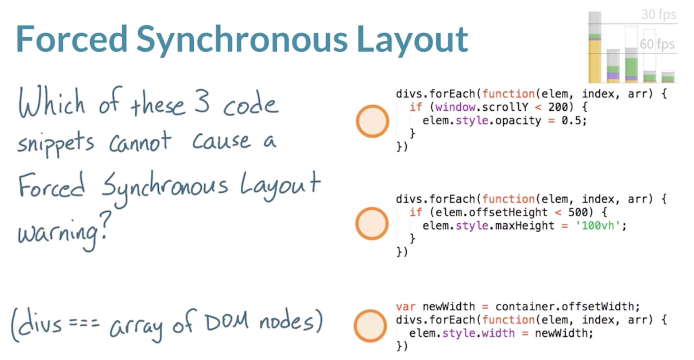

# 如何构建 60FPS 应用

### 渲染生命周期

- 渲染管道流


- 浏览器默认样式、外联样式、内联样式与 DOM 属性样式根据优先级解析，确定 DOM 节点最终的样式形成 Render Tree 的过程，称之为 `Recalculate Styles` 。


- 只有可见元素才会出现在渲染树中，主义可见的含义，例如
```CSS
    .style1 { /* 不在最终的渲染树中 */
        display: none;
    }
    /* 一下均实际存在最终的渲染树中 */
    .style2 {
        height: none;
    }
    .style3::before {
        content: '',
        display: block;
    }
    .style4 {
        position: absolute;
        left: 100%;
    }
```

- Render Tree 不包含 head 等不可见的节点


- 根据最终的样式信息确认 DOM 元素渲染的位置、形状、大小等信息的过程称为布局 `layout` 或 重排 `reflow` 。


- 确定了渲染树的信息后，接着矢量到光栅，打在屏幕上的像素点上。如果用手机拍摄低分辨率的屏幕，能看到明显的网格。


- 光栅器执行一系列绘制调用，填充像素，称这一过程为 `Paint`。


- 渲染图片时，需要从服务器获取图片字节码，浏览器解码存储于内存中，可能还需调整大小，填充在屏幕像素点上。


- 注意，所有的绘制过程未必在一个图层中完成，浏览器可能会创建多个图层。管理多个图层的渲染，最终合成一个图层，打印在屏幕上的过程，称之为 `Composite Layers` 。图层本身和图块信息上传至 `GPU` 中，然后根据指令把图像打印屏幕上。


思考：修改 body 的宽度和修改后代元素 div 的宽度，哪个触发 Layout 影响的范围更大？

[Layout Scope案例](http://udacity.github.io/60fps/lesson1/layoutPaint/index.html)

[布局边界](https://github.com/Godiswill/blog/issues/4)

- 一般情况下影响的范围一样大，都是整个文档


思考：通常修改样式，都会影响那些渲染管道流程。

- 修改 `width`


- 修改 `background`


- 修改那些只会影响 Composite 呢，请查阅 [`CSS trigger`](https://csstriggers.com)


### RAIL 评估模型


1. Response：例如用户点击按钮、勾选框、输入文本等操作，包括网络请求的时间应该控制在 `100ms` 内。超过 100ms 用户会明显的感受到延迟。
2. Animation：人的眼睛都有追踪运动轨迹的能力，对于持续的动画，每秒60帧(即 `60FPS`)用户会觉得画面顺畅，低于此用户会感知动画的卡顿。也就是说每一帧的构建只有 `16ms` 的时间，除去浏览器自身调用开销，能留给开发者JS执行的时间，大概只有 `10ms`。
3. Idle：在网页资源加载完毕或让用户感知到响应时，有 `50ms` 的空闲时间，开发者可以利用这 50ms 来执行一些不重要的或为用户下一步交互提前准备的任务。每个事件循环执行的任务时长不能超过 `50ms`，通常称超过 50ms 的任务为`长任务`。
4. Load：从网页请求到下载解析显示重要内容且和交互的时间应在 `1s` 内，即关键路径渲染流程应该不超过 `1s`。

思考：一个新闻型网站，在加载之后的空闲时间里，应该执行哪些操作？
加载：
1. 新闻内容
2. 图片资源
3. 视频媒体
4. 基本、重要功能
5. 平滑弹出评论部分

一个新闻网站，最重要的1、4当然要在加载完成之前尽早渲染好了。


- 哪些交互和动画需要 60FPS 呢。只要是连续手势操作与动画都需要。


思考：菊花图片应该在 animation 阶段请求吗？

1. 不应该，请求开销将超过16ms
2. 可以，10kb 的gif图片能够在一次请求中下载
3. 不应该，尽管图片请求可以在16ms内完成，浏览器管理图片的开销也会导致一帧超过16ms
4. 可以，如果你不确定它是否需要，不要提前下载图片。

- 1、3才是合理的，4应该早早提前gif图。


### 卡顿网站体验

- [案例1](http://output.jsbin.com/nanana/2/quiet)
- [案例2](https://d17h27t6h515a5.cloudfront.net/topher/2017/October/59defb6e_index/index.html)


### javaScript

众所周知JS是一门动态语言，即时编译(Just In Time)引擎在编译你写的代码过程中，会一点点优化你的代码。

- 避免微优化，微优化：指你自己认为写出会让浏览器稍微执行得更快的代码，但你并不知道浏览器会怎样处理以下代码，只有在你想不到其他任何优化的时候，在去考虑微优化，不要浪费时间去对比以下代码，没有任何帮助，把优化的重心放在其他方面。


思考：为了确保 60FPS 动画，该如何优化 JS 呢？
1. 应该优化代码能够利用每一纳秒吗？
2. 严格按照时间表每 16ms 执行一次 JS？（setInterval）
3. 推迟JS执行，以便优先完成基本工作吗？
4. 每帧内尽早执行JS？

- 1、之前说过，微优化意义不大；
- 2、16ms 内执行 JS 看似很美好，但并不能保证每帧准时执行
- 3、4，由于 JS 在一帧渲染管道的开始，应该尽量在渲染之初就应该 JS 执行完毕，而不影响后面布局、绘制。

#### 创建动画的必备工具：`requestAnimationFrame`
[requestAnimationFrame Polyfill](https://gist.github.com/paulirish/1579671)

- 我们知道一帧执行只有 `16ms` ，除去浏览器其他开销大概只有 `10ms`, 这 10ms 还包括布局、合成和绘制的时间，留给JS执行只有`3-4ms`。
- 如果在样式计算时，处理插进来的JS，会导致该帧的工作重新返工，可能导致这一帧丢失。

requestAnimationFrame 与 setTimeout、setInterval
- `requestAnimationFrame` 会安排JS尽量在每一帧的开始执行，然后留出足够的时间来执行渲染流程，且不被打断。

算法的魅力：[比较冒泡排序与内置排序](http://jsbin.com/feloni/3/quiet)


### 样式和布局

思考：样式修改的代价，样式改变影响元素节点的数量与 `Recalculate Style` 开销成什么（固定、指数、线性、未知）关系


CSS 选择器越复杂，解析花费开销越大。
思考：以下哪个样式执行更快

[实例测试](http://output.jsbin.com/gozula/1/quiet)
1. div.box:not(:empty):last-of-type .title
2. .box--last > .title-container > .title
3. .box:nth-last-child(-n+1) .title

CSS 样式开销不容忽视，好的命名方式，适当的复杂度都有利于网站性能的提高。

[BEM理论](https://en.bem.info/methodology/key-concepts/)、[课程](https://www.sitepoint.com/bem-smacss-advice-from-developers/)、[使用BEM命名规范来组织CSS代码](https://www.cnblogs.com/imwtr/p/8521031.html)

练习：[重新计算样式的例子](https://s3.cn-north-1.amazonaws.com.cn/static-documents/nd001/Box+Style+Change.htm)

- 从最新 Chrome 测试来看，浏览器对这方面的优化做的很好了，一下这种缩短样式查询难度的方式，得到的改进有限。

```CSS
    body.toggled main .box-container .box:nth-child(2n) {
      background: #777 !important;
    }

    /* 改成 */

    .box.gray {
        background: #777 !important;
    }

```

```javaScript
    button.addEventListener('click', function() {
      document.body.classList.toggle('toggled');
      // 新增
      var boxes = container.querySelectorAll('.box');
      for(var i = 1; i < boxes.length; i += 2) {
          boxes[i].classList.toggle('gray', document.body.classList.contains('toggled'));
      }
    });
```

- 主要的性能损耗在合成层级爆炸。
```CSS
    main .box-container .box {
      display: inline-block;
      width: 40px;
      height: 40px;
      background: #FFF;
      box-shadow: 0 1px 1px rgba(0,0,0,0.3);
      margin: 5px;
      position: relative;
      will-change: transform; /* 提升了层级 */
    }
```

#### 强制布局 FSL (Forced Synchronous Layout) / 强制重排(Force Reflow)，以下哪些会造成 FSL

[实例网站](https://udacity.github.io/60fps/lesson5/stopFSL/index.html)



[哪些属性会导致 Recalculate Style or Layout](https://github.com/Godiswill/blog/issues/3)

- `window.scroll`、`offsetHeight`、`width` 取值会导致 `Recalculate Style` 或 `Layout` 需要具体工具分析，渲染树的节点修改了样式时，在此读取 offsetWidth 的值时无法保证值是最新的，这是就要强制同步布局Recalculate Style -> Layout 触发渲染管道。


- 浏览器 Performance


停止 FSL 的策略

- 先修改样式，在读取布局属性，表面上符合管道顺序，关键在于循环，在一帧中会循环执行样式计算和布局操作。
- 先读取布局属性，会触发管道 `Recalculate Style`，但布局值可以取上一帧的值，虽然在循环中修改样式，但浏览器可以优化批量处理样式，然后Layout、Paint等后续操作。

### 合成与绘制

思考：绘制分析器执行的第一个命令是什么


- 工具查看


有关分层的概念

思考： 以下如何分层


1. 左边滑入滑出菜单
2. 固定头部
3. 主要内容

- 明确的图层划分，增加相互独立性，表明图层上的改变相互不影响
- 一般大部分图层由浏览器自动管理
- 手动提升图层，应该权衡新增图层减少绘制和新增图层增加管理开销

如何查看图层渲染
- console -> esc ->Rendering ->Layer borders
- 浅蓝色线条表示每个图层拆分成的图块，开发者是没办法控制的，这是浏览器拆分图层的方式。
- 橘色线条表示在这些元素位于自己的合成图层之上，是开发者告诉浏览器的。

提升图层的方式
```CSS
.create-new-layer {
    /* 暗示浏览器开发者会在某个时间点更改元素 transform 属性，浏览器可能会创建新图层。这样的好处是可能浏览器认为此事创建图层开销很高，不一定会创建 */
    will-change: transform;	 

    /* hacker 强制浏览器创建图层 */
    transform: translateZ(0); 
}
```

- 将元素放入独立的层有助于减少绘制问题，尤其是与动作或透明度相关的更改，如果是想更改的是文本或阴影的属性，放入独立图层也没用，因为你依然需要绘制它。所以仅在合理的情况下使用图层。
- 提升图层一般结合 `transform` 和 `opacity` 使用
- 更新图层和和合成图层最好不要超过 2ms。

如何查看有哪些图层和产生原因


项目练习：

这儿是 [News Aggregator](http://github.com/udacity/news-aggregator) 的项目地址!
这里是 janky 版本的[实际展示](http://udacity.github.io/news-aggregator/) | [下载.zip](https://s3.cn-north-1.amazonaws.com.cn/static-documents/nd001/news-aggregator.zip)
需要帮助？这里有些[提示](https://github.com/udacity/news-aggregator/tree/gh-pages/hints)！
这是 [Cameron](https://github.com/udacity/news-aggregator/tree/solution) 的应用！
这是 [bugs](https://github.com/udacity/news-aggregator/blob/gh-pages/hints/all-bugs.md) 的完整列表！

### 参考网站
1. [评估关键渲染路径](https://developers.google.com/web/fundamentals/performance/critical-rendering-path/measure-crp)
2. [避免大型、复杂的布局和布局抖动](https://developers.google.com/web/fundamentals/performance/rendering/avoid-large-complex-layouts-and-layout-thrashing#avoid-forced-synchronous-layouts)
3. [以用户为中心的性能指标](https://developers.google.com/web/fundamentals/performance/user-centric-performance-metrics#user-centric_performance_metrics)
4. [使用 Chrome DevTools 中的 Device Mode 模拟移动设备](https://developers.google.com/web/tools/chrome-devtools/device-mode/?utm_source=dcc&utm_medium=redirect&utm_campaign=2016q3)
5. [视频网站](https://classroom.udacity.com/courses/ud860)


web work 练习：

1. [Here's the image manipulation repo!](https://github.com/udacity/web-workers-demo)
2. [MDN 上的 Web Worker 文档](https://developer.mozilla.org/zh-CN/docs/Web/API/Web_Workers_API/Using_web_workers)
3. [Web Workers on HTML5 Rocks](http://www.html5rocks.com/en/tutorials/workers/basics/)
4. [Here's the repo with the solution for your perusal](https://github.com/udacity/web-workers-demo/tree/solution)


JS内存管理
1. [编写快速且节省内存的 JavaScript](http://www.smashingmagazine.com/2012/11/writing-fast-memory-efficient-javascript/)
2. [MDN 上的内存管理](https://developer.mozilla.org/zh-CN/docs/Web/JavaScript/Memory_Management)
3. [Build New Games 上的高性能垃圾收集器友好代码](http://buildnewgames.com/garbage-collector-friendly-code/)
